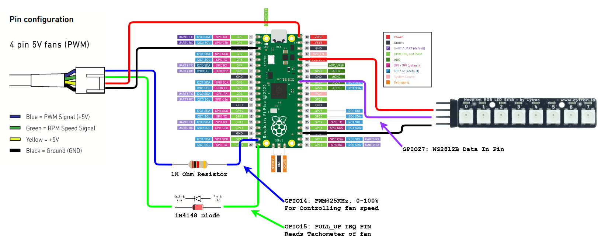
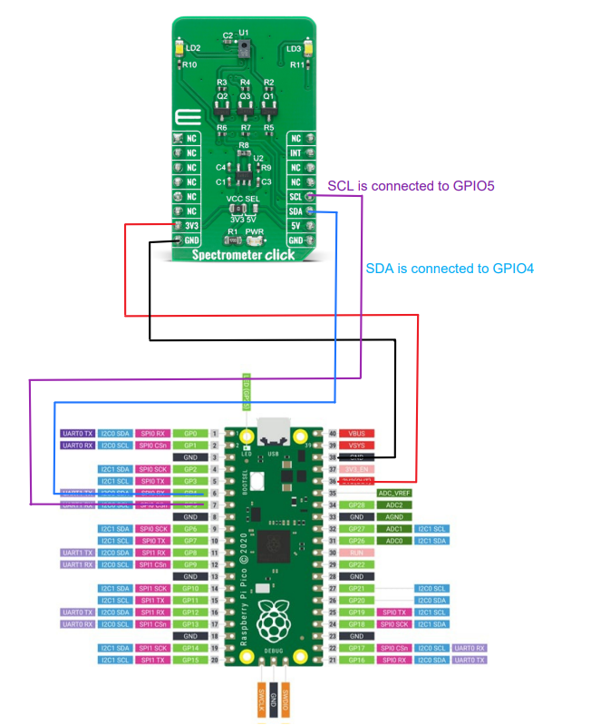
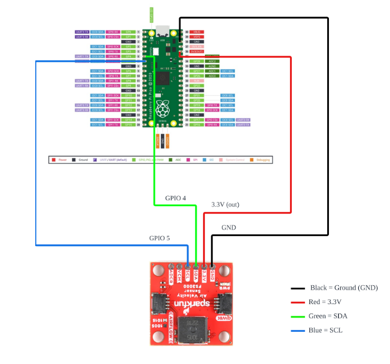
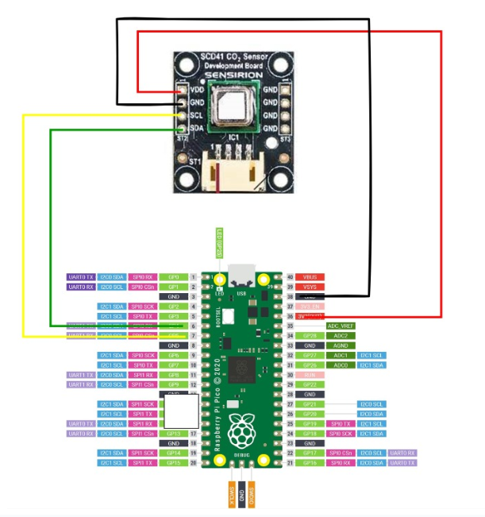
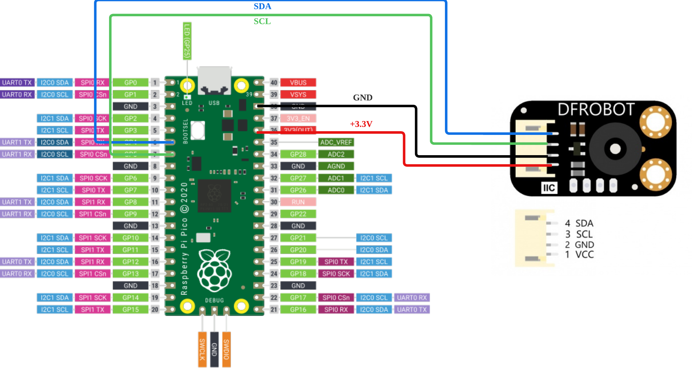

# inf2004-embedded-systems-project

# Project description

This repository contains the source code for the INF2004 Embedded Systems Project, aimed at using multiple Raspberry Pi Picos as a distributed and decentralized urban farming automation system.

The project is written in C using the [Pico SDK](https://github.com/raspberrypi/pico-sdk) and uses the [RP2040](https://www.raspberrypi.org/documentation/rp2040/getting-started/) microcontroller on the Raspberry Pi Pico.

Due to the popularity of the Arduino platform, most of the drivers for the sensors used in this project are written for the Arduino platform. And are therefore written in C++ and not C. This means that the drivers had to be ported to C in order to be used in this project. The ported drivers can be found in the `drivers` folder.

Additionally, in order to facilitate the ease of porting the already existing Arduino drivers to C, we have also written a custom C library that provides the same functionality as the Arduino `Wire` library. This library can be found in the `lib` folder, along with other libraries that are used in this project.

## Physical setup

The physical setup of this project contains 5 Raspberry Pi Picos, each with a different sensor attached to it. The sensors are:

- AS7341 11-channel light spectral sensor
- FS3000 Airflow sensor
- MLX90614 IR temperature sensor
- SCD41 CO2 sensor

Along side the sensors, the following components are also used in the physical setup:

- Noctua NF-A4x10 5V, 4-pin PWM Fan (40mm x 10mm)
- WS2812B RGB LED strip

The Nocuta fan is used to simulate a fan that is used to cool the plants in the urban farm. While the WS2812B RGB LED strip is used to simulate a grow light that is used to provide light to the plants in the urban farm.

### Physical topology

### Software Flow diagram - Sensors

### Software Flow diagram - WS2812B LED

### Software Flow diagram - 5V PWM Fan

## Wiring diagrams

As msot of the sensors used in this project are I2C sensors, the wiring diagrams for the sensors are very similar. The only major difference is the pico that is in-charge of driving the 5V fan and the WS2812B LED strip.

## 1. 5V Fan and WS2812B Wiring

## 2. AS7341 Spectro Wiring

## 3. FS3000 Airflow Wiring

## 4. SCD41 CO2 Sensor Wiring

## 5. MLX90614 IR Temperature Wiring

# Drivers for sensors

The drivers for each of the sensors and LEDs can be found in the `drivers` folder. Inside the `drivers` folder, there are 2 types of project folders made for each sensors. The first one ending in `_sample` is an example project that shows how to use the sensor library. The second one ending in `_mqtt` is the actual code that's uploaded to the raspberry pi pico that is in charge of the sensor.

For more information, please refer to the comments in the code.

# Contributors

Thanks to the following contributors who have contributed to this project:

[NekoCoaster](https://github.com/NekoCoaster) (Team Lead)

- Written drivers for 5V Nocuta fan
- Re-packaged WS2812B driver used in this project
- Setting up and configuring centralized MQTT broker
- Development of i2c_tools library
- Development of Mqtt_Rebuilt library
- Code documentation

[Yeo Wen Qin, Kaynn](https://github.com/wqyeo)

- Ported drivers for MLX90614 IR temperature sensor
- Designed the dashboard for displaying sensor data
- Bug fixing and code refactoring
- Physical topology design
- Code documentation

[FICE](https://github.com/Zhwee)

- Ported drivers for AS7341 11-channel light spectral sensor
- Designed the dashboard for displaying sensor data
- Bug fixing and code refactoring
- Physical topology design
- Code documentation

[Amabel](https://github.com/Amabellzq)

- Ported drivers for FS3000 airflow sensor
- Designed the dashboard for displaying sensor data
- Bug fixing and code refactoring
- Physical topology design
- Code documentation

[junwei-jwk](https://github.com/junwei-jwk)

- Ported drivers for SCD41 CO2 sensor
- Designed the dashboard for displaying sensor data
- Bug fixing and code refactoring
- Physical topology design
- Code documentation

## Sensor and SDK libraries used in this project:

- [Pico SDK](https://github.com/raspberrypi/pico-sdk)
- [Arduino-Pico](https://github.com/earlephilhower/arduino-pico)
- [AS7341 11-channel light spectral sensor](https://github.com/DFRobot/DFRobot_AS7341)
- [FS3000 Airflow sensor](https://github.com/sparkfun/SparkFun_FS3000_Arduino_Library)
- [MLX90614 IR temperature sensor](https://github.com/DFRobot/DFRobot_MLX90614)
- [SCD41 CO2 sensor](https://github.com/Sensirion/embedded-i2c-scd4x)
- [WS2812B RGB LED strip](https://forums.raspberrypi.com/viewtopic.php?t=322218)
